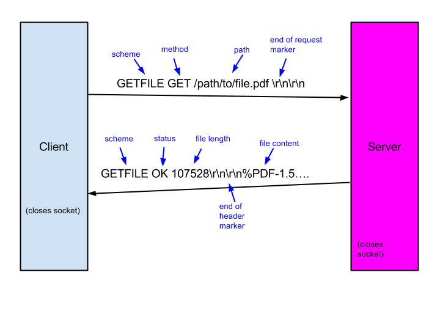

# GetFile Implementation README

In this project, we design and implement a multi-threaded server that serves static files based on the GetFile protocol, which is a simple HTTP-like protocol. Alongside the server, we also create a multi-threaded client that acts as a load generator for the server. Both the server and client are written in C and based on a sound, scalable design.

# Project Description
## 1. Echo Client-Server Warmup
#### Implementation
Firstly, to familiarize with C’s standard socket API, we build a separate program that models a basic echo client-server where a client establishes a connection with a listening server using sockets. Once the connection is made the client will send messages to the server which the server will copy and send right back to the client.

#### Flow of Control

- Client
All source code for the client is written in the file **echoclient.c**.
    1. Parse the command line to store the parameters.        
    2. Use Socket API from **<sys/socket.h>** to send message to server.
    3. The **send** and **read** functions of Socket API are used.               
    4. Close socket after receiving and printing message.

- Server
All source code for the server is written in the file **echoserver.c**.
    1. Parse the command line to store the parameters.
    2. Use Socket API from **<sys/socket.h>** to create a socket and bind to a socket for listening.
    3. The **send** and **read** functions of Socket API are used.  
    4. The socket is closed.

#### Testing
- The client sends the message.
- The server receives the message from the client and echos.
- The client prints the message sent from the server.

## 2. File Transfer Warmup
#### Implementation
Next, we models a basic file transfer client-server based on the echo client-server program.

#### Flow of Control

- Client
All source code for the client is written in the file **transferclient.c**.
    1. Parse the command line to store the parameters.  
    2. The hostname is resolved into an IP using *getaddrinfo*.
    3. Use Socket API from **<sys/socket.h>** to connect to server.
    4. The output file is created and opened.
    5. Receive file using **recv** from server.
    6. Save file from the server.        
    7. The socket is closed.
- Server
All source code for the client is written in the file **transferserver.c**.
    1. Parse the command line to store the parameters.  
    2. The file to be transfered is opened for reading.
    3. Use Socket API from **<sys/socket.h>** to create a socket and bind to a socket for listening.
    4. Once a connection from a client has been accepted, load data from the file and send that data to the client using **send**.
    5. When the end of the file is reached, the socket is closed.
#### Testing
- The server loads and sends the file to the client.
- The client saves the file sent from the serve.

## 3.  Part1 Single-threaded Getfile Protocol
#### Implementation
Next, the GETFILE protocol was implemented using the client-server connection mechanism designed in the echo client-server program and the file transfer mechanism designed in the transfer client-server program. 

#### Flow of Control

- Client
The implementation is in the files **gfclient.c**.

    Other designs:
    1. **gfcrequest_t**: this struct is used to hold all information about the request.
    2. Build header: use strcat to build header message.
    3. Receive header form server and do status check. Go to the next step only when the status is "OK" and the header is complete.
    4. Receive contents of the file transfered from server and write the content to a local file.

- Server
The implementation is in the files **gfserver.c**.

    Other designs:
    1. Receive header form client and do scheme check. Go to the next step only when the status is "OK" and the header is complete.

#### Testing
1. The client handles a prematurely closed connection during the transfer of the file.
2. The client handles a prematurely closed connection during the transfer of the response header.
3. The client handles various status from the server.
4. The client properly handles an OK response and a long message.
5. The client properly handles an OK response and a short message.

## 4. Part 2 Multithreaded Getfile Server
#### Implementation
We implement GETFILE protocal libraries in a multithreaded fashion. This was done using the **boss-worker thread pattern**.

In Part 1, the Getfile server can only handle a single request at a time. To overcome this limitation, we make Getfile server multi-threaded by implementing own version of the handler in **handler.c** and updating **gfserver_main.c**  as needed. The main, i.e. boss, thread will continue listening to the socket and accepting new connection requests. New connections will, however, be fully handled by worker threads. The pool of worker threads should be initialized to the number of threads specified as a command line argument.

Similarly on the client side, the Getfile workload generator can only download a single file at a time. In general for clients, when server latencies are large, this is a major disadvantage. We make client multithreaded by modifying **gfclient_download.c**. This will also make testing your getfile server easier.

In the client, a pool of worker threads should be initialized based on number of client worker threads specified with a command line argument. Once the worker threads have been started, the boss enqueues the specified number of requests (from the command line argument) to them. They should continue to run. Once the boss confirms all requests have been completed, it should terminate the worker threads and exit.

#### Flow of Control

#### Testing
1. Verify parallel thread activity serving files.
2. Multiple clients downloading mixed files simultaneously.
3. The client handles an INVALID response from the server.
4. The initialization and cleanup are done properly.
6. The client simultaneously downloads multiple files in a timely manner.

## References
* [POSIX Threads (PThreads)](https://computing.llnl.gov/tutorials/pthreads/)
* [Linux Sockets Tutorial](http://www.linuxhowtos.org/C_C++/socket.htm)
* [Practical TCP/IP Sockets in C](http://cs.baylor.edu/~donahoo/practical/CSockets/)
* [Guide to Network Programming](http://beej.us/guide/bgnet/)
* [Simple socket program example](http://c.biancheng.net/cpp/html/3030.html)
